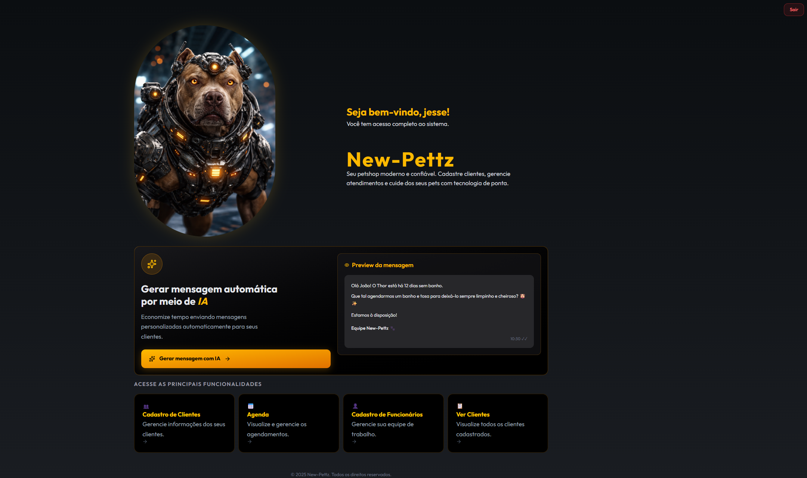
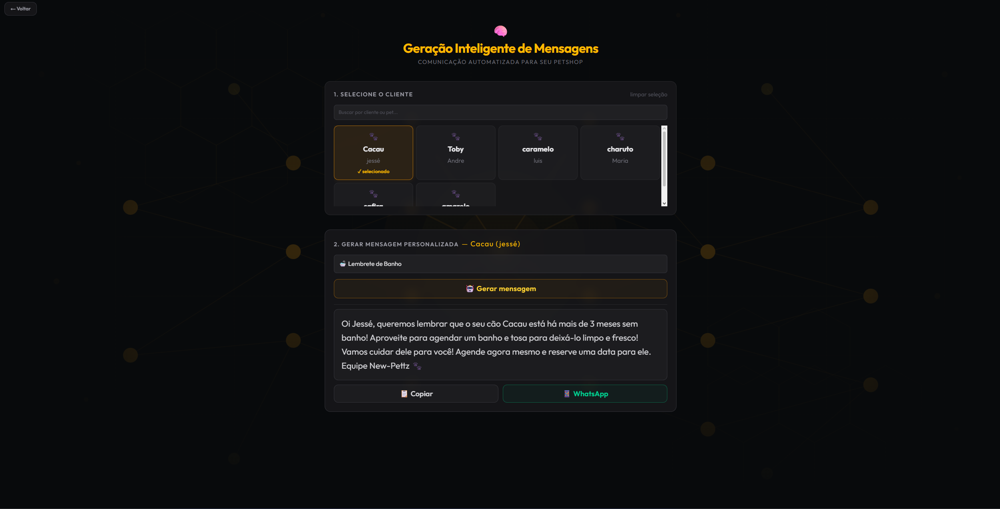
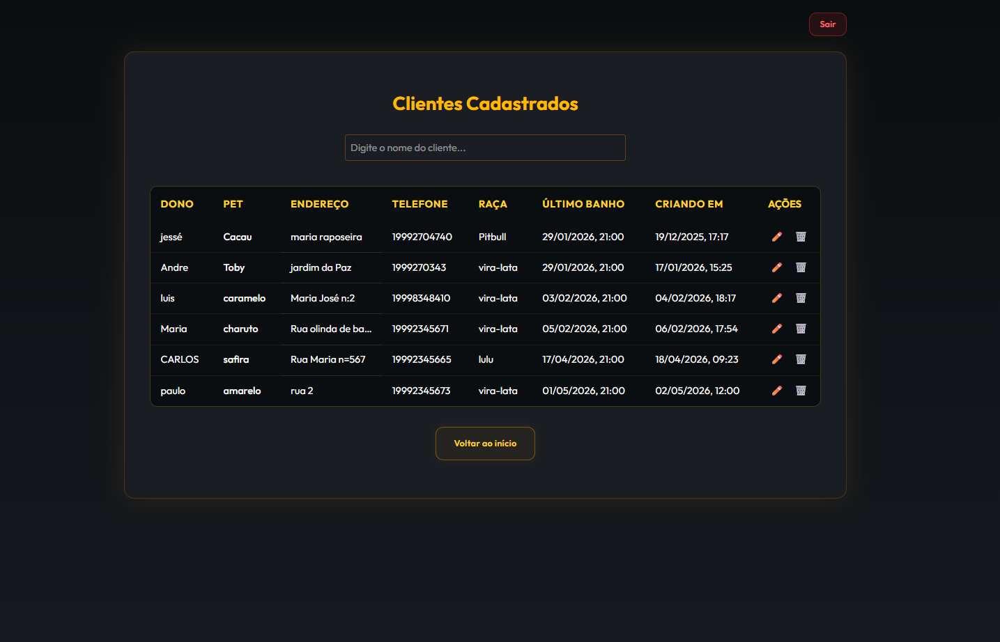
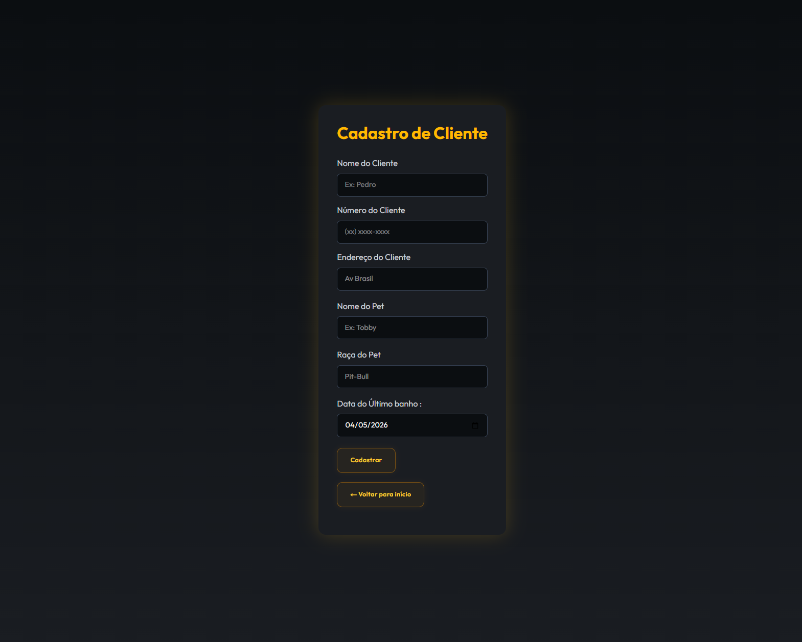
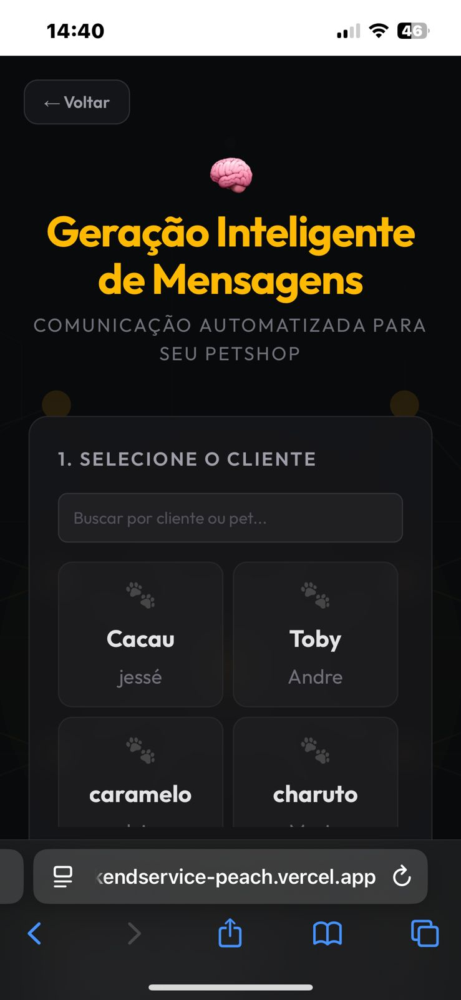

<div align="center">


# 🐾 New-Pettz

### Sistema completo de gestão para petshops com IA integrada

[](https://nextjs.org/)
[](https://nestjs.com/)
[](https://www.typescriptlang.org/)
[](https://neon.tech/)
[](https://www.prisma.io/)

**[🌐 Acessar Aplicação](https://petshopbackendservice-peach.vercel.app)** · **[📄 Documentação API](https://petshop-backend-service.onrender.com/api)** · **[💻 Repositório](https://github.com/jesse-springman/petshop-backend-service)**

> 🔐 Credenciais de demonstração: `usuário: recrutador` · `senha: demo1234`

</div>

---

## 📸 Preview

<div align="center">

### Dashboard Principal



### Geração de Mensagens com IA



### Agenda

<video src="./docs/agenda.gif" autoplay loop muted width="100%"></video>

### Clientes Cadastrados



### Cadastro de Cliente



### Mobile — IA no iPhone



</div>

---

## 🚀 Sobre o Projeto

O **New-Pettz** nasceu como uma solução real para um petshop — com o objetivo de resolver problemas concretos do negócio e ao mesmo tempo demonstrar habilidades técnicas de um desenvolvedor full-stack moderno.

O sistema permite que donos de petshop **gerenciem clientes, agendamentos e se comuniquem com clientes via WhatsApp** — tudo em uma interface moderna, responsiva e integrada com IA.

---

## ✨ Funcionalidades

| Funcionalidade             | Descrição                                                          |
| -------------------------- | ------------------------------------------------------------------ |
| 🤖 **IA para mensagens**   | Gera mensagens personalizadas via Groq API com efeito de digitação |
| 📲 **Integração WhatsApp** | Envia a mensagem gerada diretamente para o cliente                 |
| 📅 **Agenda**              | Visualização mensal de agendamentos com status                     |
| 👥 **Gestão de Clientes**  | CRUD completo com dados do pet e histórico de banho                |
| 🔐 **Autenticação JWT**    | Login seguro com cookie HttpOnly + localStorage                    |
| 📄 **API documentada**     | Swagger com todos os endpoints documentados                        |
| 📱 **Responsivo**          | Funciona em desktop, Android e iOS (Safari ITP resolvido)          |
| 🧪 **Testes**              | Cobertura de testes no frontend e backend                          |
| ⚙️ **CI/CD**               | Pipeline automatizado com GitHub Actions                           |

---

## 🛠️ Stack Técnica

### Frontend

- **Next.js 15** com App Router
- **TypeScript**
- **TailwindCSS**
- **React Testing Library + Jest**

### Backend

- **NestJS** com arquitetura modular
- **Prisma ORM** + **PostgreSQL (Neon)**
- **JWT** com guards customizados
- **Swagger** para documentação
- **Jest** para testes unitários

### Infra & DevOps

- **Vercel** — frontend em produção
- **Render** — backend em produção
- **GitHub Actions** — CI/CD automatizado
- **Docker** — ambiente local

---

## 🧪 Testes

```bash
# Frontend
cd front-end
npm run test

# Backend
cd back-end
npm run test
```

O projeto conta com testes unitários no frontend (Testing Library) e backend (Jest), integrados ao CI/CD que valida todos os testes a cada push na branch `main`.

---

## 🔍 Desafios Técnicos Resolvidos

**🍎 Safari iOS + Cross-Origin Cookies**
O Safari bloqueia cookies de domínios diferentes por política ITP. A solução foi usar `localStorage` + header `Authorization` para as requisições de API, e setar um cookie no mesmo domínio do frontend via `document.cookie` para o middleware da Vercel conseguir ler.

**⚙️ JWT Secret em produção**
O `process.env.JWT_SECRET` era lido antes do carregamento das variáveis de ambiente na Render. Solução: migrar para `JwtModule.registerAsync` com `ConfigService`.

**🔒 Middleware no Edge Runtime**
O middleware da Vercel roda no servidor — não tem acesso ao `localStorage` nem a cookies de outros domínios. Aprendizado: browser, middleware e API são três contextos completamente diferentes.

---

## ⚙️ Rodando Localmente

```bash
# Clone o repositório
git clone https://github.com/jesse-springman/petshop-backend-service

# Backend
cd back-end
npm install
npx prisma migrate dev
npm run start:dev

# Frontend
cd front-end
npm install
npm run dev
```

### Variáveis de Ambiente

**Backend `.env`:**

```env
DATABASE_URL=
JWT_SECRET=
GROQ_API_KEY=
ALLOWED_ORIGIN=
NODE_ENV=development
```

**Frontend `.env.local`:**

```env
NEXT_PUBLIC_API_URL=http://localhost:3001
```

---

> 🔐 Credenciais de demonstração: `usuário: recrutador` · `senha: demo123`

---

## 📄 Documentação da API

A API está documentada com Swagger e disponível em produção:

🔗 **[https://petshop-backend-service.onrender.com/api](https://petshop-backend-service.onrender.com/api)**

> ⚠️ O servidor pode demorar até 30 segundos para responder na primeira requisição (cold start do plano gratuito da Render).

---

<div align="center">

Desenvolvido por [Jessé Springman](https://github.com/jesse-springman)

</div>
